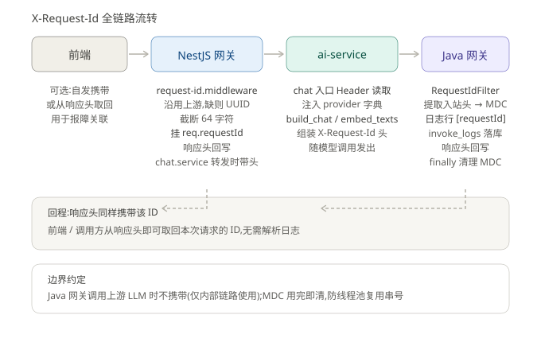

# 双网关架构设计文档

> 范围:`packages/NestJS`(BFF 网关,:6011)、`packages/model-gateway`(Java 模型网关,:6015)
> 版本基准:2026-09-10 安全加固后的现状(经 `npm run build` / `mvn compile` 验证)

---

## 1. 总体拓扑与职责划分

```
┌─────────┐  JWT   ┌─────────────┐  service-key  ┌───────────┐  service-key  ┌───────────────┐
│  前端    │──────▶│ NestJS BFF  │──────────────▶│ ai-service │─────────────▶│ model-gateway │
│ 6012/13 │        │  :6011      │               │  :6010    │               │  :6015        │
└─────────┘        └──────┬──────┘               └───────────┘               └──────┬────────┘
                          │ users/perm/channels 共享库                               │
                          ▼                                                        ▼
                    ┌──────────┐   X-Channel-Key 路由渠道                    上游 LLM API
                    │  MySQL   │◀────────────────────────────────────────────┘(真实地址/密钥只在网关侧)
                    └──────────┘
```

**职责边界（BFF + 资源网关模式，各司其职）**：

| 职责 | 归属 | 理由 |
|---|---|---|
| 用户/角色/权限管理、JWT 签发、登录 | NestJS | 面向人的规则引擎，权限规则唯一权威 |
| 对话编排、Agent 循环、会话/checkpoint | ai-service（经 NestJS 转发） | LLM 应用层 |
| 渠道路由、限流、熔断、计量(invoke_logs)、告警 | model-gateway | 资源面，渠道真实地址/密钥不出网关 |
| 唯一计量来源 | `invoke_logs` 表 | QPM/TPM 结算、熔断事件、渠道调度都读它 |

## 2. 鉴权架构：签发/校验分离

### 2.1 NestJS 侧（签发 + 统一入口）

守卫链（全局注册，顺序执行）：

```
请求 ─▶ JwtAuthGuard ─▶ PermissionGuard ─▶ Controller
        │ @Public 放行          │ 无 @RequirePerm:仅加载用户+状态校验
        │ 服务密钥模拟(X-Service-Key   │ 'auth':任意登录用户
        │ +X-User-Id,常量时间比较)   │ 'super':仅超管
        │                      │ 权限码:超管全通,否则校验有效权限集
```

- **登录防爆破**（`auth.service.ts`）：同 `username|ip` 失败 5 次锁 15 分钟；成功登录清除记录；内存 Map 超过 1 万条自动清理过期项
- **JWT claims**：`sub` + `username` + `jti`（为登出/吊销预留）；已删除两侧都不消费的 `isSuperAdmin/jobLevelRank` 冗余 claim（防误导）
- 权限模型：职级批量绑定 + 个人逐项覆盖（个人绑定存在则以其 `allowed` 为准），超管直通

### 2.2 Java 侧（只校验不签发）

```
/api/** ─▶ AuthInterceptor   (JWT 校验 + DB 重查 + 权限码,默认拒绝)
/v1/**  ─▶ ServiceKeyInterceptor (内部服务密钥 + X-User-Id 身份透传)
```

- **默认拒绝（本轮加固的核心变化）**：`/api/**` 下无 `@RequirePermission` 注解的接口一律 401。原先默认放行，忘加注解即裸奔
- JWT 只用共享密钥校验（`gateway.jwt.secret`），本服务无签发逻辑、无过期时间配置
- 以 DB 重查用户为准：权限/禁用变更即时生效（JWT claim 仅承载身份）
- `ServiceKeyInterceptor`：`MessageDigest.isEqual` 常量时间比较防时序攻击；X-Username 经 URL 编码传递

### 2.3 鉴权快照缓存（两侧一致，30s TTL）

改造前：每请求约 4 次权限查库 × 2 侧。改造后：

- **NestJS** `users.service.loadAuthContext(userId)`：30s 进程内缓存；`PermissionGuard` 走缓存加载。所有权限/用户写操作（绑定/解绑/禁用/删除）后调用 `invalidateAuthCache(userId?)` **主动失效**——"改权限立即生效"语义不变
- **Java** `AuthInterceptor.authCache`（ConcurrentHashMap，30s TTL）：命中直接放行，未命中回源 DB 后回填

## 3. 可观测性：X-Request-Id 全链路

```
生成(NestJS middleware) ─透传▶ ai-service ─透传▶ model-gateway(MDC)
   │响应头回写                │provider 载体         │日志行 [%X{requestId}]
   │挂 req.requestId         │build_chat/embed_texts│invoke_logs.requestId 落库
   └──────────── 回程响应头均携带,调用方可直接取回 ────────────┘
```

| 环节 | 实现 |
|---|---|
| 生成规则(三侧一致) | 沿用上游 → 缺则 UUID → 截断 64 字符 |
| NestJS | `common/request-id.middleware.ts` 全局中间件;`chat.service.ts:343` 转发时条件携带(缺 ID 不报错) |
| ai-service | `main.py` 入口读 Header → `provider["request_id"]` → `agent/client.py#build_chat`(Agent+直答唯一出口)与 `rag/engine.py#embed_texts` 组装 |
| Java | `common/RequestIdFilter`(@Order(1))→ MDC;日志模板 `%X{requestId:-}` 零侵入带出;`finally MDC.remove` 防线程池串号;`InvokeService.newLogRow` 落 `invoke_logs.requestId` |
| 边界 | 上游 LLM 不携带(仅内部链路);任何一层缺头静默降级 |



## 4. 安全配置基线

| 项 | NestJS | model-gateway |
|---|---|---|
| CORS | `CORS_ORIGINS` 白名单(缺省仅本地 6012/6013) | `gateway.cors.allowed-origins` 白名单 |
| 服务密钥 | `timingSafeEqual` 常量时间比较 | `MessageDigest.isEqual` |
| 登录防爆破 | 5 次失败锁 15 分钟(username+ip) | —(无登录入口) |
| DDL | `DB_SYNCHRONIZE` 显式配置(生产必须 false + migration) | `ddl-auto: update`(H2 内存库;接 MySQL 时同规则) |
| 敏感头 | X-Username URL 编码透传 | 原样解码 |

## 5. 健康检查与生命周期

- `GET /health`(两侧,`@Public`/不过滤)：NestJS 返回进程状态;Java 探测 DB,不通返回 503——供 k8s/负载均衡探针直接使用
- **优雅停机(两侧)**：NestJS `enableShutdownHooks`;Java `server.shutdown: graceful` + `timeout-per-shutdown-phase: 30s`。收到 SIGTERM 停接新请求,存量 SSE 流排空后退出

## 6. 配置清单(.env / application.yml)

**NestJS(.env)**：`PORT`(6011)、`JWT_SECRET`、`JWT_EXPIRES_IN`(默认 7d)、`NESTJS_SERVICE_KEY`(与 Java `GATEWAY_SERVICE_KEY` 同值)、`CORS_ORIGINS`、`DB_SYNCHRONIZE`

**Java(application.yml)**：`PORT`(6015)、`GATEWAY_SERVICE_KEY`、`CORS_ORIGINS`、`gateway.jwt.secret`、`gateway.invoke.connect/read-timeout-ms`、`gateway.seed.enabled`

## 7. 已知结构性风险与演进路线

| 编号 | 风险 | 现状 | 演进方向 |
|---|---|---|---|
| R1 | 权限解析规则 TS/Java 双实现人工同步 | `resolvePermissionCodes` ≡ `PermissionService#resolveCodes` | Java 改调 NestJS internal 接口,规则单权威 |
| D1 | 双向跨库读表(分布式单体) | NestJS 读 channels 表;Java 读 users/perm 四表 | 各自收口为 internal API,为拆库铺路 |
| H1 | 限流/熔断/TPM 进程内存态 | 多实例失效、重启配额归零 | Redis 化(RateLimiter/CircuitBreaker/配额结算) |
| S1 | 无 refresh token/吊销 | jti 已预埋 | 短效 access + refresh,jti 黑名单 |
| O1 | ai-service 自身日志未内嵌 requestId | 只透传不消费 | Python 侧日志 filter 读 contextvar |
| O2 | 密钥单把开三扇门、无轮换 | service key 明文配置 | 按调用方分 key + 轮换机制 |

**建议顺序**：联调验证本轮加固 → O1(半小时) → S1 → R1(最大结构性收益) → H1 → D1。
